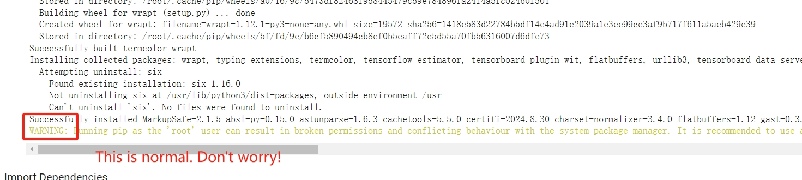

# Hello World Training

This example shows how to train a 2.5 kB model to generate a `sine` wave.

## Table of contents

- [Hello World Training](#hello-world-training)
  - [Table of contents](#table-of-contents)
  - [Overview](#overview)
  - [Training](#training)
  - [Trained Models](#trained-models)
  - [Model Architecture](#model-architecture)
  - [Note](#note)

## Overview

1. Dataset: Data is generated locally in the Jupyter Notebook.
2. Dataset Type: **Structured Data**
3. Deep Learning Framework: **TensorFlow 2.4.0**
4. Language: **Python 3.8**
5. Model Size: **2.5 kB**
6. Model Category: **Regression**

This script is modified from: https://github.com/RTduino-libraries/tflite-micro/tree/tinyml-petebook-baseline/tensorflow/lite/micro/examples/hello_world/train , which is the baseline of the book of *TinyML: Machine Learning with TensorFlow Lite on Arduino and Ultra-Low-Power Microcontrollers*

## Training

Train the model in the cloud using Google Colaboratory or locally using a
Jupyter Notebook.

<table class="tfo-notebook-buttons" align="left">
  <td>
    
  </td>
  <td>
    <a target="_blank" href="https://github.com/RTduino-libraries/TensorFlow-Lite-Micro/blob/rt-dev/examples/hello_world/train/train_hello_world_model.ipynb">Jupyter Notebook</a>
  </td>
</table>

*Estimated Training Time: 10 minutes.*

## Trained Models

Download Link | [hello_world.zip](https://storage.googleapis.com/download.tensorflow.org/models/tflite/micro/hello_world_2020_12_28.zip)
------------- | ------------------------------------------------------------------------------------------------------------------------

The `models` directory in the above zip file can be generated by following the
instructions in the [Training](#training) section above. It
includes the following 3 model files:

| Name | Format | Target Framework | Target Device |
| :------------- |:-------------|:-------------|-----|
| `model.pb` | Keras SavedModel | TensorFlow | Large-Scale/Cloud/Servers   |
| `model.tflite` *(2.5 kB)*  | Integer Only Quantized TFLite Model | TensorFlow Lite | Mobile Devices|
| `model.cc`  | C Source File | TensorFlow Lite for Microcontrollers | Microcontrollers |

## Model Architecture

The final model used to simulate a sine wave is displayed below. It is a
simple feed forward deep neural network with 2 fully connected layers with
ReLu activations and a final fully connected output layer with as shown below.

*This image was derived from visualizing the 'model.tflite' file in [Netron](https://github.com/lutzroeder/netron)*

## Note

It is normal if runs the a warning or error when install the environment.

